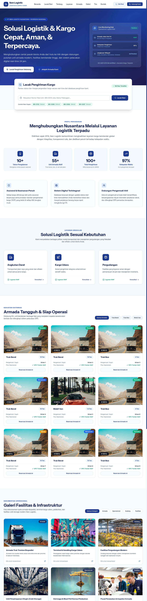
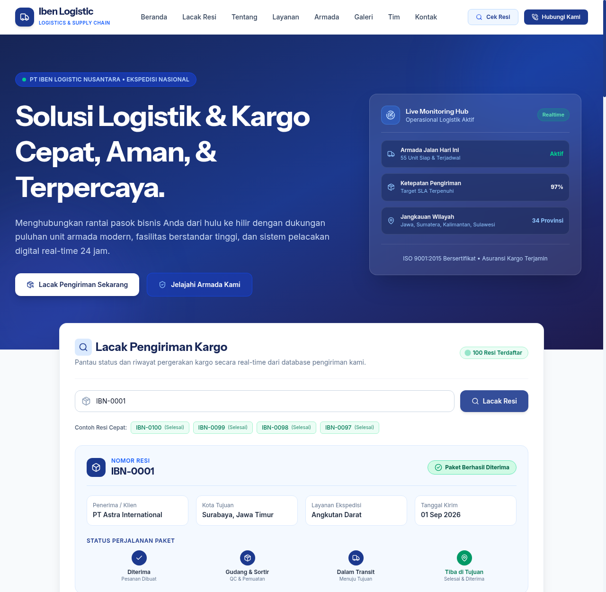
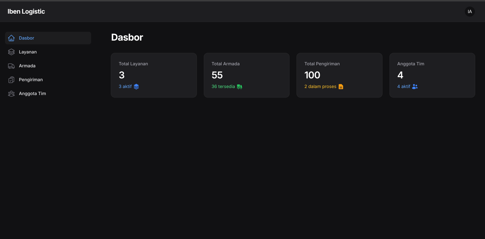
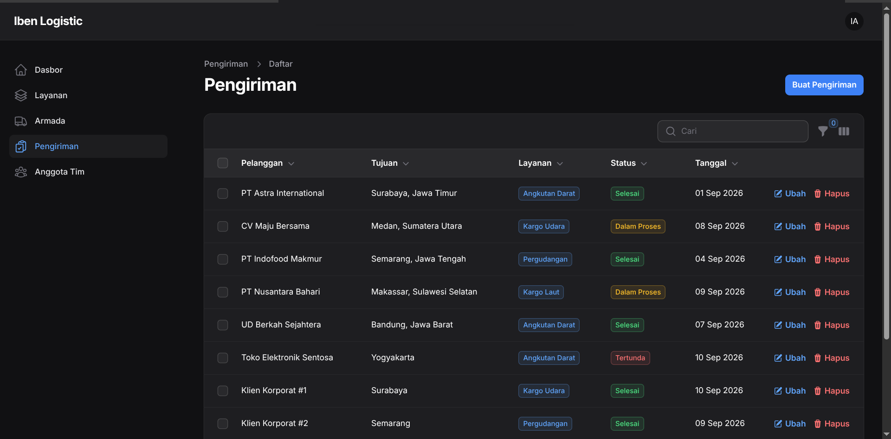
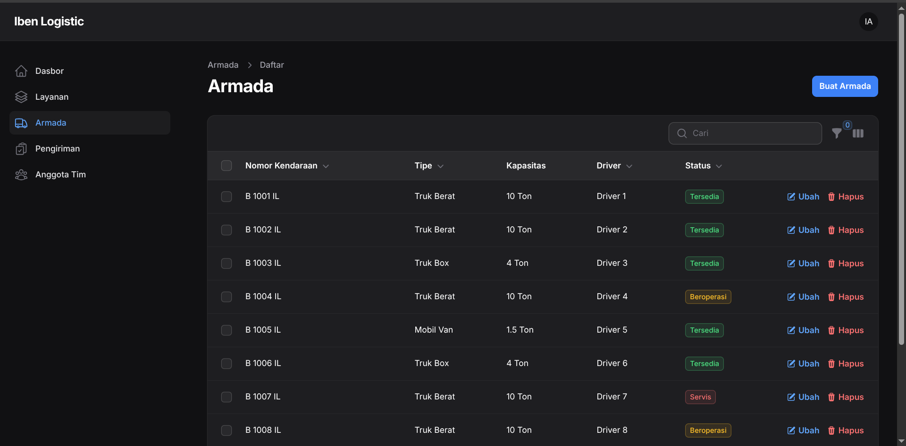
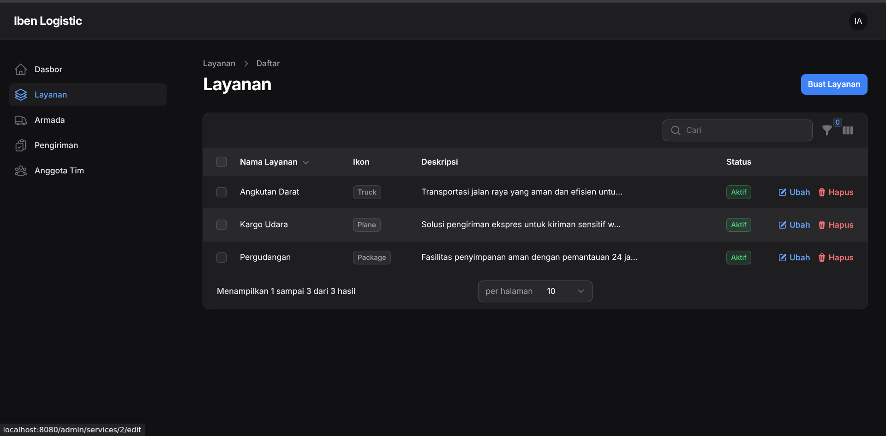
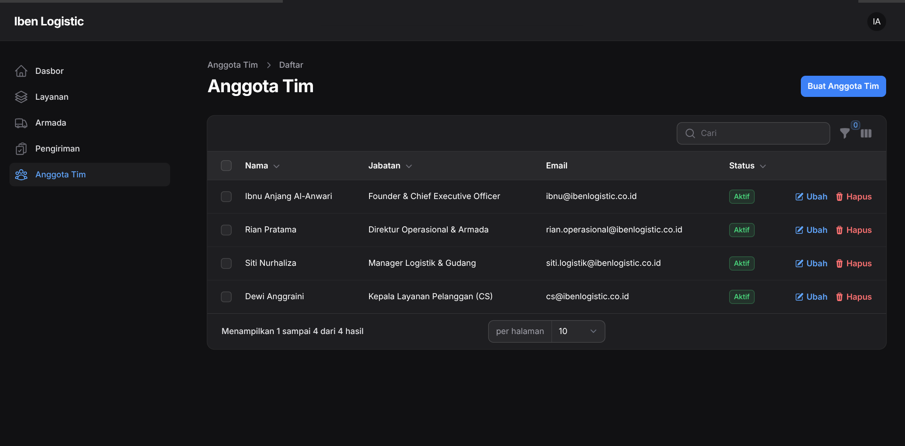
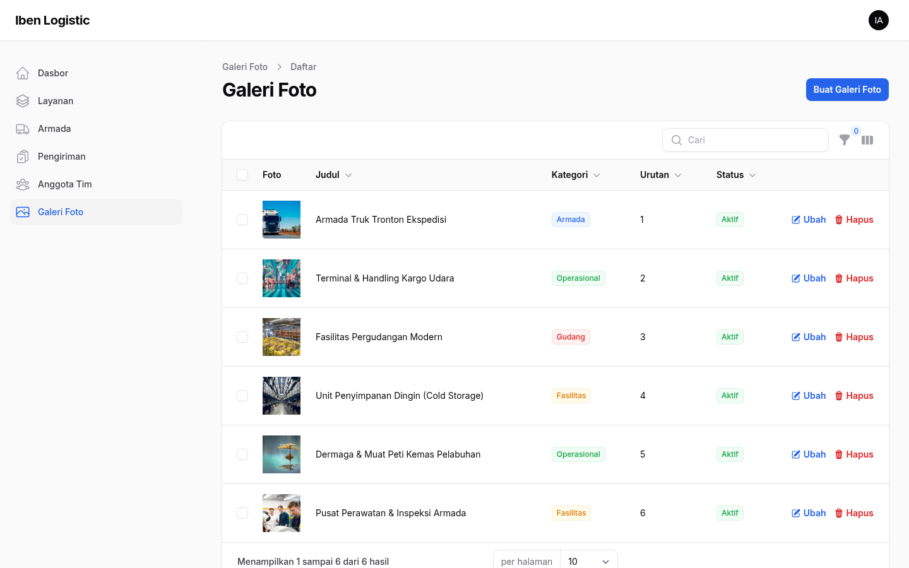

# Iben Logistic — Sistem Informasi Manajemen Logistik & Kargo Terpadu

<p align="center">
  
</p>

<p align="center">
  <strong>Solusi Logistik yang Aman, Cepat, dan Terpercaya untuk Kebutuhan Distribusi Nasional.</strong><br>
  Proyek Portofolio & Latihan Uji Kompetensi Keahlian (Ujikom) Rekayasa Perangkat Lunak / Pengembangan Web.
</p>

<p align="center">
  
  
  
  
  
  
  
</p>

---

## 📌 Daftar Isi

1. [Tentang Proyek](#-tentang-proyek)
2. [Fitur Unggulan](#-fitur-unggulan)
3. [Tangkapan Layar (Screenshots)](#-tangkapan-layar-screenshots)
4. [Teknologi yang Digunakan](#-teknologi-yang-digunakan)
5. [Panduan Instalasi & Menjalankan](#-panduan-instalasi--menjalankan)
   - [Metode 1: Menggunakan Docker (Sangat Direkomendasikan)](#metode-1-menggunakan-docker-sangat-direkomendasikan)
   - [Metode 2: Menjalankan Secara Lokal (Manual)](#metode-2-menjalankan-secara-lokal-manual)
6. [Akun Default & Kredensial Pengujian](#-akun-default--kredensial-pengujian)
7. [Struktur Direktori Repositori](#-struktur-direktori-repositori)
8. [Dokumen Desain & Laporan](#-dokumen-desain--laporan)
9. [Kontributor & Lisensi](#-kontributor--lisensi)

---

## 📖 Tentang Proyek

**Iben Logistic** adalah sistem informasi manajemen logistik berbasis web yang dirancang untuk mengelola rantai pasok transportasi barang, armada kendaraan, operasional pergudangan, galeri fasilitas, dan data pengiriman barang pelanggan secara real-time.

Aplikasi ini memadukan **Landing Page publik modern** yang informatif untuk calon mitra/klien bisnis dengan **Panel Administrasi berbasis Filament v3** yang powerful, intuitif, dan responsif bagi operator logistik.

---

## ✨ Fitur Unggulan

### 🌐 1. Landing Page Publik (100% Dinamis & Modern)
- **Pelacakan Resi Real-Time (Cek Resi Dinamis):** Widget interaktif untuk melacak 100 data pengiriman secara langsung via nomor resi (cth: `IBN-0001`, `IBN-0002`) atau nama pelanggan, lengkap dengan visual *4-step progress timeline* (Diterima &rarr; Gudang &rarr; Transit &rarr; Tiba).
- **Showcase Armada Dinamis:** Menampilkan katalog 55 unit armada dari database lengkap dengan foto berasio presisi (16:10), nomor plat kendaraan, kapasitas tonase, nama supir, dan filter tab interaktif (Truk Berat, Truk Box, Mobil Van).
- **Katalog Layanan Dinamis:** Data layanan kargo darat, udara, dan pergudangan yang bersumber langsung dari database dengan tautan konsultasi instan.
- **Galeri Fasilitas & Infrastruktur Presisi:** Dokumentasi operasional beresolusi tinggi dengan rasio aspek standar 16:10 (bebas distorsi / tidak terpotong aneh), filter kategori fasilitas, serta fitur *Lightbox Modal Preview* saat gambar diklik.
- **Struktur Tim Pimpinan Dinamis:** Profil dewan direksi dan manajer operasional terhubung langsung dari database *Anggota Tim*.
- **Statistik & Metrik Otomatis:** Counter pengalaman, jumlah armada aktif, total pengiriman sukses, dan tingkat ketepatan waktu (SLA) terhitung otomatis dari MariaDB.
- **Desain Korporat & Responsif:** Menggunakan palet biru maritim (#1e3a8a), tipografi *Instrument Sans* & *Inter*, serta navigasi ramah mobile dengan drawer menu responsif.

### 🛡️ 2. Panel Admin (Filament v3)
- **Dasbor Analitik Real-time:** Widget ringkasan total pengiriman, armada beroperasi, dan metrik performa.
- **Manajemen Pengiriman (Shipments):**
  - Pemantauan status (Dalam Proses, Selesai, Tertunda).
  - Filter interaktif berdasarkan layanan dan status pengiriman.
  - Pengurutan data (sorting) dan penyesuaian visibilitas kolom (*column toggle*).
- **Manajemen Armada:** Pencatatan nomor kendaraan, tipe kendaraan (Van, Box, Truk Tronton), kapasitas muatan, nama driver, status servis, serta foto armada.
- **Manajemen Galeri Foto:** Manajemen portofolio fasilitas dan armada dengan fitur unggah gambar (*upload*) dan pengaturan urutan tampil.
- **Manajemen Anggota Tim:** CRUD data staf dan pimpinan lengkap dengan foto avatar.
- **Dukungan Tema Lengkap:** Beralih mulus antara **Light Mode**, **Dark Mode**, dan **System Mode**.
- **Perbaikan Dropdown Responsif:** Seluruh menu popover/dropdown (menu profil, filter tabel, pemilih kolom) dikonfigurasi presisi agar membuka ke arah kiri dan tidak terpotong pada berbagai resolusi layar (laptop, tablet, hingga mobile).

---

## 📸 Tangkapan Layar (Screenshots)

<div align="center">

| Landing Page (Hero & Layanan) | Dashboard Admin (Filament v3) |
|:---:|:---:|
|  |  |

| Manajemen Pengiriman (Tabel & Filter) | Manajemen Armada |
|:---:|:---:|
|  |  |

| Manajemen Layanan | Manajemen Anggota Tim |
|:---:|:---:|
|  |  |

| Manajemen Galeri Foto | Tampilan Landing Page Lengkap |
|:---:|:---:|
|  |  |

</div>

---

## 🛠️ Teknologi yang Digunakan

| Kategori | Teknologi | Deskripsi |
|---|---|---|
| **Core Framework** | [Laravel 11](https://laravel.com/) | Framework PHP modern dengan arsitektur MVC tangguh |
| **Admin Panel** | [Filament v3](https://filamentphp.com/) | TALL Stack Admin Panel (Tailwind, Alpine, Laravel, Livewire) |
| **Styling & UI** | [Tailwind CSS 3](https://tailwindcss.com/) | Utility-first CSS framework untuk tampilan responsif |
| **Reactivity** | [Alpine.js](https://alpinejs.dev/) & [Livewire 3](https://livewire.laravel.com/) | Interaktivitas komponen dinamis tanpa reload halaman |
| **Database** | [MariaDB 11.4](https://mariadb.org/) | Sistem manajemen basis data relasional berkecepatan tinggi |
| **Containerization** | [Docker](https://www.docker.com/) & Docker Compose | Standardisasi lingkungan pengembangan dan deployment |
| **Icons** | [Lucide Icons](https://lucide.dev/) & [Heroicons](https://heroicons.com/) | Paket ikon vektor modern dan konsisten |
| **UI/UX Design** | [Penpot](https://penpot.app/) | Platform open-source untuk prototyping dan wireframing antarmuka |

---

## 🚀 Panduan Instalasi & Menjalankan

### Metode 1: Menggunakan Docker (Sangat Direkomendasikan)

Proyek ini telah dilengkapi konfigurasi Docker Compose siap pakai (Apache + PHP 8.3 + MariaDB + phpMyAdmin).

1. **Clone repositori:**
   ```bash
   git clone git@github.com:ibnu-anjang/Latihan-Ujikom.git
   cd Latihan-Ujikom/iben-logistic
   ```

2. **Jalankan otomatisasi setup via Makefile:**
   ```bash
   make setup
   ```
   *Perintah di atas akan secara otomatis membangun container, membuat file konfigurasi `.env`, men-generate `APP_KEY`, menginstall dependensi composer, menjalankan migrasi database, dan mengisi data dummy (seeder).*

3. **Atau jalankan manual via Docker Compose:**
   ```bash
   cp .env.example .env
   cp src/.env.example src/.env
   docker compose up -d --build
   docker compose exec --user www-data app composer install
   docker compose exec --user www-data app php artisan key:generate
   docker compose exec --user www-data app php artisan migrate:fresh --seed
   docker compose exec --user www-data app php artisan storage:link
   ```

4. **Akses aplikasi di browser:**
   - **Landing Page Publik:** [http://localhost:8080](http://localhost:8080)
   - **Panel Admin:** [http://localhost:8080/admin](http://localhost:8080/admin)
   - **phpMyAdmin:** [http://localhost:8081](http://localhost:8081)

---

### Metode 2: Menjalankan Secara Lokal (Manual)

Jika ingin menjalankan tanpa Docker di lingkungan lokal (LAMP/XAMPP/Native PHP):

1. **Masuk ke direktori aplikasi Laravel:**
   ```bash
   cd iben-logistic/src
   ```

2. **Install dependensi Composer dan Node.js:**
   ```bash
   composer install
   npm install && npm run build
   ```

3. **Konfigurasi Environment:**
   ```bash
   cp .env.example .env
   php artisan key:generate
   ```
   *Sesuaikan konfigurasi database di file `.env` dengan kredensial database lokal Anda.*

4. **Migrasi & Seeding Database:**
   ```bash
   php artisan migrate:fresh --seed
   php artisan storage:link
   ```

5. **Jalankan Web Server:**
   ```bash
   php artisan serve
   ```
   Aplikasi akan berjalan di `http://127.0.0.1:8000`.

---

## 🔐 Akun Default & Kredensial Pengujian

Gunakan kredensial berikut untuk masuk ke **Panel Admin**:

| Parameter | Nilai |
|---|---|
| **URL Login** | [http://localhost:8080/admin/login](http://localhost:8080/admin/login) |
| **Email** | `admin@ibenlogistic.com` |
| **Kata Sandi (Password)** | `password` |
| **Peran (Role)** | Administrator Utama |

### 📍 Rute & Endpoint Panel Admin (Clean Indonesian URLs)

| Modul / Menu | URL Endpoint | Deskripsi |
|---|---|---|
| **Dashboard** | `http://localhost:8080/admin` | Dasbor ringkasan metrik statistik |
| **Layanan** | `http://localhost:8080/admin/layanan` | Manajemen katalog jenis layanan logistik |
| **Armada** | `http://localhost:8080/admin/armada` | Manajemen kendaraan armada & driver |
| **Pengiriman** | `http://localhost:8080/admin/pengiriman` | Pemantauan data transaksi pengiriman kargo |
| **Anggota Tim** | `http://localhost:8080/admin/anggota-tim` | Manajemen staf pimpinan & profil tim |
| **Galeri Foto** | `http://localhost:8080/admin/galeri` | Manajemen dokumentasi foto fasilitas & operasional |

---

## 📁 Struktur Direktori Repositori

```text
Latihan-Ujikom/
├── iben-logistic/               # Direktori utama aplikasi web
│   ├── docker/                  # Konfigurasi container Docker (PHP 8.3 + Apache)
│   ├── docker-compose.yml       # Definisi layanan Docker (App, DB, phpMyAdmin)
│   ├── Makefile                 # Shortcut perintah manajemen container (up, setup, artisan)
│   ├── PROJECT.md               # Spesifikasi dan ringkasan teknis proyek
│   └── src/                     # Source code aplikasi Laravel 11
│       ├── app/
│       │   ├── Filament/        # Resource, Halaman, dan Widget Filament v3
│       │   │   ├── Resources/   # Resource Pengiriman, Armada, Galeri, Tim, Layanan
│       │   │   └── Widgets/     # Widget Dasbor Statistik
│       │   └── Models/          # Model Eloquent (Pengiriman, Armada, Galeri, dll)
│       ├── database/
│       │   ├── migrations/      # Skema database relasional
│       │   └── seeders/         # Data awal pengujian & foto seeder
│       ├── resources/
│       │   └── views/           # Blade templates (Landing page publik & override Filament)
│       └── routes/
│           └── web.php          # Definisi routing aplikasi
├── prototype/                   # Prototipe antarmuka UI/UX (Penpot & dokumentasi)
│   ├── Dokumen-Prototype-UIUX-Iben-Logistic.pdf
│   └── prototype-doc.html
├── screenshots/                 # Dokumentasi tangkapan layar untuk laporan & presentasi
├── Laporan-Tugas-Pemweb-Ibnu-Anjang.pdf  # Dokumen laporan resmi tugas/latihan ujikom
└── README.md                    # Dokumentasi utama proyek
```

---

## 📄 Dokumen Desain & Laporan

- **Dokumen Laporan Lengkap:** [`Laporan-Tugas-Pemweb-Ibnu-Anjang.pdf`](Laporan-Tugas-Pemweb-Ibnu-Anjang.pdf)
- **Dokumentasi UI/UX Prototype:** Terletak pada folder [`prototype/`](prototype/) berisi mockup antarmuka dan alur interaksi pengguna yang dibuat dengan Penpot.

---

## 👨‍💻 Kontributor & Lisensi

- **Guru Pengampu:** Pak Hendra (Guru Mata Pelajaran Pemrograman Web)
- **Pengembang / Siswa:** [Ibnu Anjang Al-Anwari](https://github.com/ibnu-anjang)
- **Program Keahlian:** Rekayasa Perangkat Lunak / Pengembangan Web (XII PPLG)
- **Lisensi:** Proyek ini didistribusikan di bawah lisensi [MIT License](LICENSE). Bebas digunakan sebagai referensi belajar dan pengembangan lebih lanjut.
